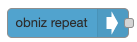
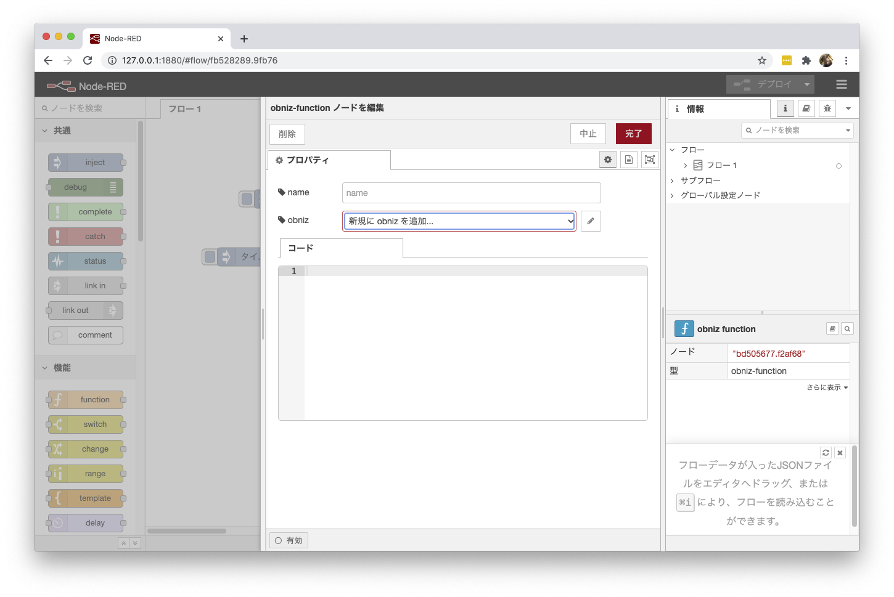
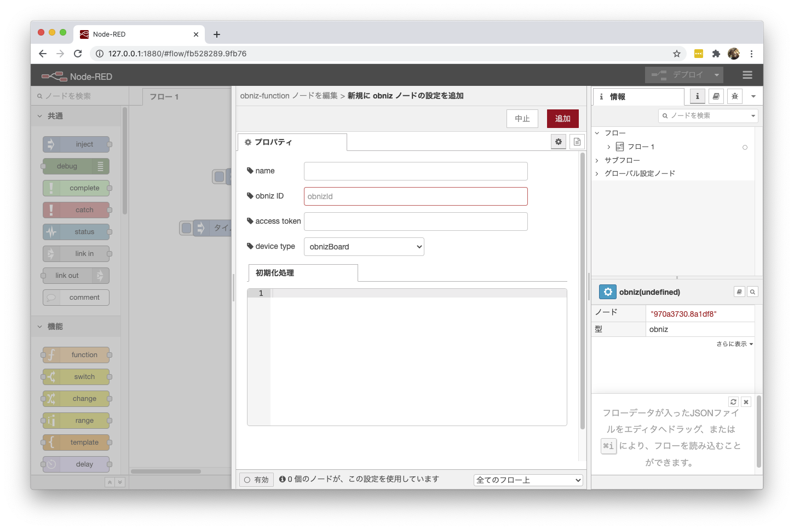
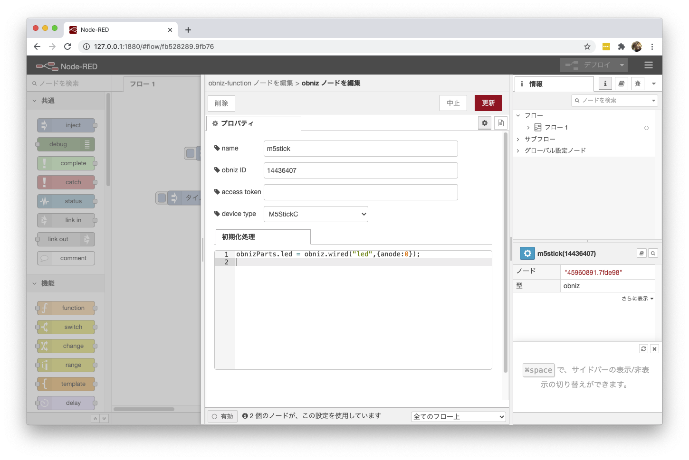
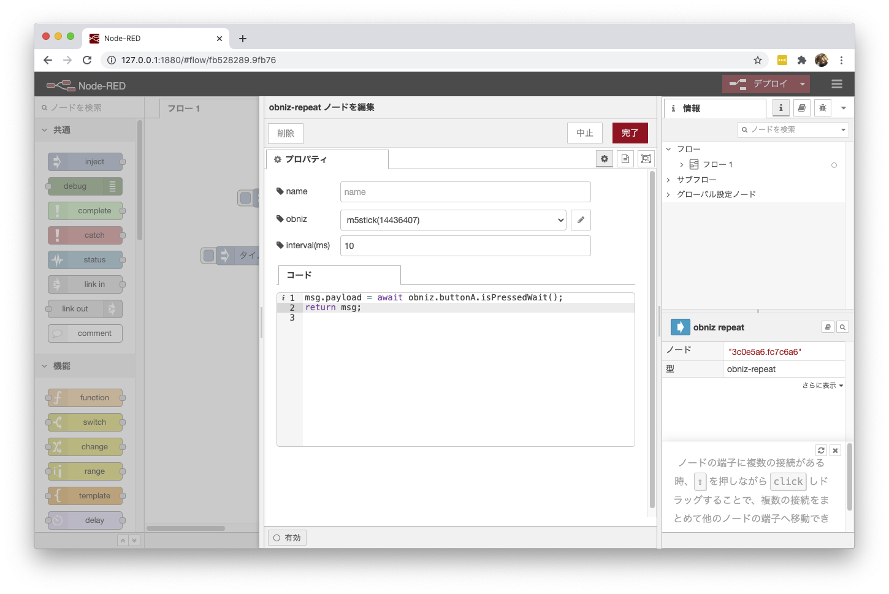
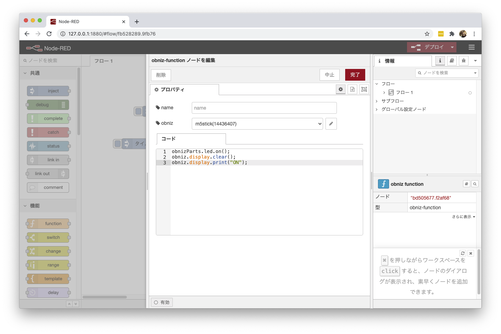

## node-red obniz node

Node-REDのobnizノードです

[obniz websocket api](https://obniz.io/doc/about_obniz_api)に基づいて使うことができます


## obnizとはなにか

Electronics as a Serviceという、電子回路をAPIから操作できるクラウドシステムです
[こちらのサイト](https://obniz.io/doc/)にて詳細情報を見れます


## Install

次のコマンドでインストールしてください
```
npm install node-red-contrib-obniz
```

もしくはNode-RED上で、下記の方法でもインストールできます
1. Node-REDの `メニュー` > `パレットの管理` をクリック
2. "obniz"で検索
3. "Install"ボタンをクリック


## ノードの種類

obnizノードには２つのノードがあります。

- obniz repeatノード



センシングなど、定期的にデータを取得したい場合に使用します。


- obniz functionノード


obniz.displayなどobnizを通じて出力をしたい場合などに使います。
出力も備えていますので、obnizを通じて得た情報を出力することもできます。

## 使い方

### 共通

obniz repeatノードおよびobniz functionノードは、どちらも使用するobnizデバイスを指定する必要があります。

各ノードのプロパティより、"新規にobnizを追加”を選択してobnizを追加します。



追加する際の設定項目は次のとおりです



初期化処理では、パーツライブラリの設定などを行うことができます。

ここでは、obnizとobnizPartsの2つの変数が定義されています。
obnizには設定したobnizのインスタンスがセットされますので、
`obniz.display.print("hello")` などと書くことができます。

obnizPartsは、全obnizノードで共通のオブジェクトがセットされます。
obniz.wiredしたパーツなどを保管しておき、obniz repeat/functionノードで使用することができます



### obniz repeatノード

obnizがオンラインの間、繰り返し処理するコードです。
共通設定と同じく、obnizとobnizPartsの2つの変数が定義されています。




基本的にはfunctionノードと同じ使い方ができます。
出力するには、`return msg`をつかってください。

非同期処理を行う場合は、`node.done()` と `node.send(msg)` を使ってください。


### obniz functionノード

obnizがオンラインの間、繰り返し処理するコードです。
共通設定と同じく、obnizとobnizPartsの2つの変数が定義されています。



基本的にはfunctionノードと同じ使い方ができます。
出力するには、`return msg`をつかってください。

非同期処理を行う場合は、`node.done()` と `node.send(msg)` を使ってください。


## LICENSE
[LICENSE.txt](./LICENSE.txt)を参照ください
